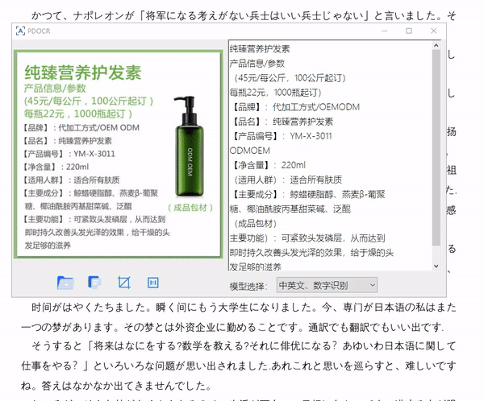

# PDOCR

## 介绍

- PDOCR是博主基于[PaddleOCR](https://www.progdomain.com/wp-content/plugins/cp-link-open/link.php?a=aHR0cHM6Ly9naXRodWIuY29tL1BhZGRsZVBhZGRsZS9QYWRkbGVPQ1I=)识别引擎开发的一款文字识别（OCR）软件。PDOCR支持打开png、jpg、bmp格式图片进行识别；也可直接粘贴图片进行识别；此外还提供了截图识别功能，截图完毕自动识别！PDOCR现已支持中英文、数字、韩文、日文、中文繁体、泰卢固文、卡纳达文、泰米尔文、拉丁文、阿拉伯字母、斯拉夫字母、梵文字母识别！

  

## 依赖库

1. BCGControlBar 31.0 ： [点击跳转](https://bcgsoft.com/bcgcontrolbarpro.htm)
2. PaddleOCR：[点击跳转](https://github.com/PaddlePaddle/PaddleOCR)

## 意见反馈

[点击跳转](https://www.progdomain.com/pdocr/)
